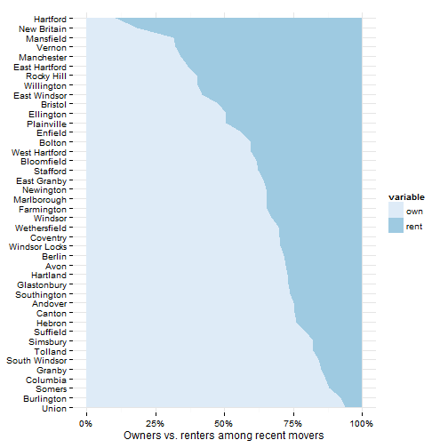
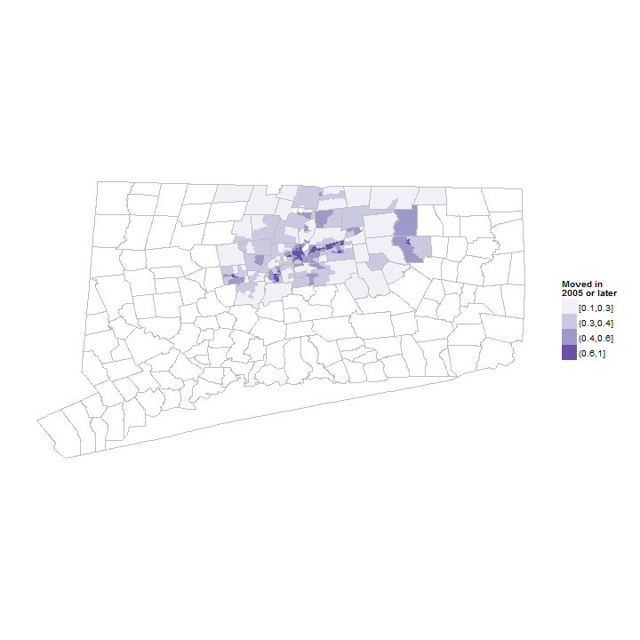

## Stability indicators

This section covers indicators related to whether families and children in the region have recently moved. 

## Data and limitations

Data on household mobility (or stability or transience) is available through the American Community Survey. Most reports look at whether families have moved within the last five years, although some include data on whether families have moved within the last year. 

As with other ACS data, for small areas (or small subgroups), the estimates have high margins of error and are generally rolling estimates for a 5-year period. 

## What do we already know?

Indicators as to whether families or children have recently moved are used in the reports below. 

### Local

* [Hartford Neighborhood Assessments](http://courantblogs.com/cityline/wp-content/uploads/2013/04/Hartford-Neighborhood-Assessment.pdf) report included data on whether a household had been living at the same address for less than five years as a measure of neighborhood stability. Data was drawn from the ACS. 
* [Health Equity Index](http://www.cadh.org/health-equity/health-equity-index.html) also included whether households had moved in the last five years.  

### Other relevant efforts

* [Boston Indicators Project](http://www.bostonindicators.org/) looks at the percent of households that have moved in the last five years as an indicator of 'Civic Vitality.' Data is drawn from the ACS. 
* [The Child Well-Being Index](http://fcd-us.org/our-work/child-well-being-index-cwi) includes the rate of children who have moved within the last year, using Census data, but from historical census tables, not the current ACS. 

## Sample results

The census asks about housing tenure and provides data on how long residents have lived in occupied housing units, be they owners or renters. The data is organized by years, with those that have moved '2005 or later' as the most recent category. Other groupings include from 2000 to 2004, 1990 to 1999, and by decade back to 1969. Consequently, the data on mobility is really saying whether the individual surveyed moved into their residence after 2005; it is not a general index of transience or (in)stability in a region. 

The sample results are for all towns in Hartford and Tolland Counties since it is easier to extract ACS data that way. This can be trimmed to a smaller region later though. 

The map makes clear that the more urban areas have high rates of mobility, along with some of the university centers.  

 

Since the data is drawn from the ACS, there are margins of error associated with the values, which can be large for small towns. Hartford and East Hartford have significantly higher rates of mobility - 56 percent in Hartford - while many of the smaller towns (Hebron, Union) have fewer than 20 percent of the population moving in the last 5 years. 

 

The ACS data breaks out housing tenure for owners vs. renters, so we can look further at whether recent moves are primarily for owners or renters in the town. 

As seen in the housing data, towns with low home-ownership rates, like Hartford, also have high mobility for residents. 

 

The ACS data can be looked at by neighborhood (for 5-year estimates); below are maps of the region again for those that have moved into their current residence since 2005 (using estimates from the ACS for 2007 - 2011). Areas of new residents are clustered, possibly along transportation routes. 

 

Map for Hartford neighborhoods using HNA data. 

